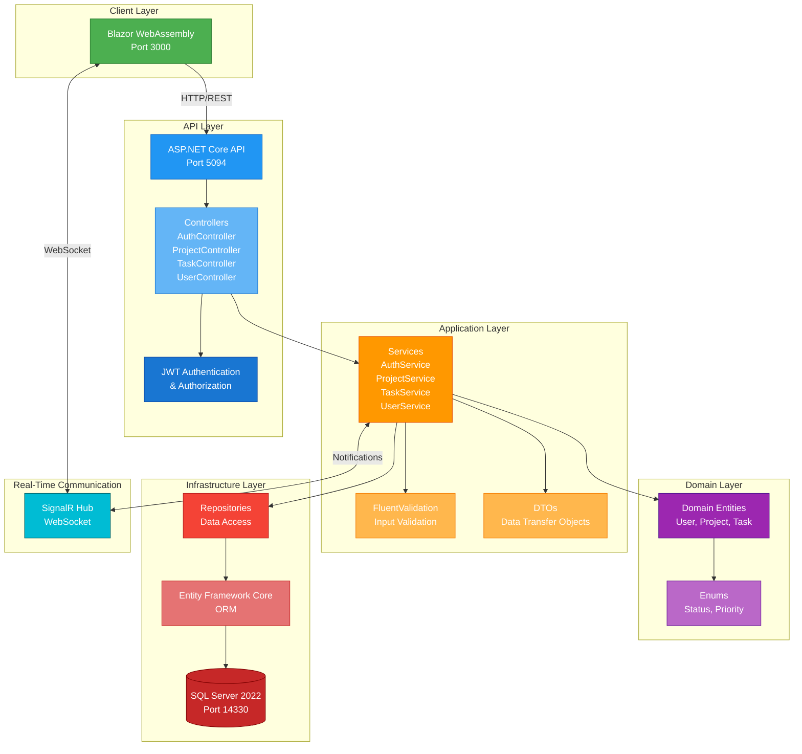
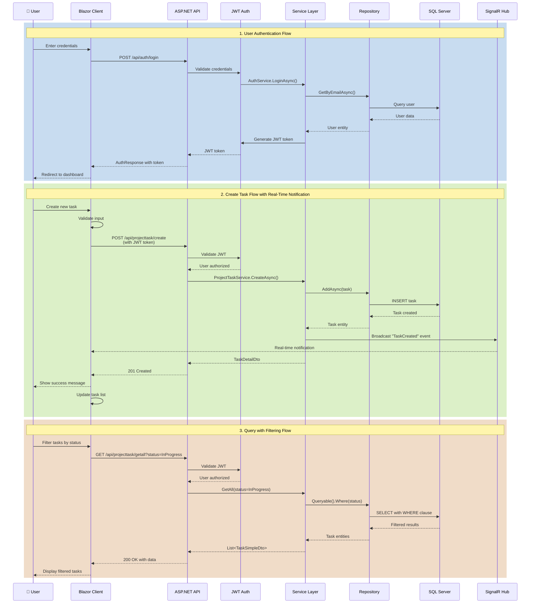

# FocusFlow
Production‑ready Task Management Application

A full-stack task management system built with .NET 10, Blazor WebAssembly, SQL Server, and Docker. Features include project management, task tracking with status and priority levels, real-time updates via SignalR, and user assignment capabilities.

## 📋 Table of Contents
- [Technology Stack](#technology-stack)
- [Prerequisites](#prerequisites)
  - [For Docker Compose Deployment](#for-docker-compose-deployment)
  - [For Local Development](#for-local-development)
- [Quick Start](#quick-start)
  - [Option 1: Docker Compose (Recommended)](#option-1-docker-compose-recommended)
  - [Option 2: Local Development](#option-2-local-development)
- [Architecture](#architecture)
  - [System Architecture Diagram](#system-architecture-diagram)
  - [Component Interaction Flow](#component-interaction-flow)
  - [Architecture Explanation](#architecture-explanation)
- [Test Execution Instructions](#test-execution-instructions)
- [Additional Documentation](#additional-documentation)
- [Contributing](#contributing)
- [License](#license)
- [Author](#author)
- [Acknowledgments](#acknowledgments)


---

## 🛠️ Technology Stack

### Backend
- **.NET 10.0** - Latest .NET framework for high-performance APIs
- **ASP.NET Core Web API** - RESTful API architecture
- **Entity Framework Core 9.0** - ORM for database operations
- **SQL Server 2022** - Relational database
- **JWT Authentication** - Secure token-based authentication
- **SignalR** - Real-time bidirectional communication
- **FluentValidation** - Input validation library

### Frontend
- **Blazor WebAssembly** - Client-side C# framework
- **Bootstrap 5** - Responsive UI framework
- **SignalR Client** - Real-time update handling

### Infrastructure
- **Docker** - Container platform
- **Docker Compose** - Multi-container orchestration
- **nginx** - Static file server for Blazor WASM

---

## 📦 Prerequisites

### For Docker Compose Deployment

#### Required Software

1. **Docker Desktop** (v20.10 or higher)
   - **Linux**: Docker Engine + Docker Compose plugin
   - **Windows/Mac**: Docker Desktop includes both
   
   **Verification**:
   ```bash
   docker --version
   docker compose version
   ```
   Expected output: `Docker version 20.10+` and `Docker Compose version v2.0+`

2. **Git** (for cloning the repository)
   - **Why**: Version control to download project files
   - **Download**: [Git](https://git-scm.com/downloads)
   
   **Verification**:
   ```bash
   git --version
   ```

#### System Requirements
- **RAM**: Minimum 4GB (8GB recommended)
  - SQL Server container: ~2GB
  - API container: ~512MB
  - Client container: ~100MB
  
- **Disk Space**: Minimum 5GB free
  - Docker images: ~2GB
  - SQL Server data: ~500MB (grows with usage)
  - Build cache: ~1-2GB

- **Ports Available**:
  - `3000` - Client (Blazor WebAssembly)
  - `5094` - API (.NET)
  - `14330` - Database (SQL Server)

---

### For Local Development

#### Required Software

1. **.NET 10.0 SDK**
   - **Download**: [.NET 10.0 SDK](https://dotnet.microsoft.com/download/dotnet/10.0)
   
   **Verification**:
   ```bash
   dotnet --version
   ```
   Expected output: `10.0.x`

2. **SQL Server 2022** (or compatible version)
   - **Options**:
     - SQL Server Express (free, local development)
     - SQL Server Developer Edition (free, full-featured)
     - SQL Server in Docker (easiest for development)
     - Azure SQL Database (cloud option)
   
   - **Download**: [SQL Server Downloads](https://www.microsoft.com/en-us/sql-server/sql-server-downloads)
   
   **Verification**:
   ```bash
   # For Docker SQL Server
   docker ps | grep mssql
   
   # For local SQL Server (Windows)
   sqlcmd -S localhost -U sa -Q "SELECT @@VERSION"
   ```

#### System Requirements
- **RAM**: Minimum 8GB (16GB recommended for comfortable development)
- **Disk Space**: Minimum 10GB free
  - .NET SDK: ~1GB
  - Visual Studio/Rider: ~5-10GB
  - SQL Server: ~2GB
  - Project + packages: ~500MB

---

## 🚀 Quick Start

### Option 1: Docker Compose

This approach runs the entire application stack (database, API, and client) in isolated containers. **No local .NET installation required**.

#### Step 1: Clone the Repository
```bash
git clone https://github.com/yourusername/FocusFlow.git
cd FocusFlow
```

#### Step 2: Configure Environment Variables
```bash
# Copy the example environment file
cp .env.example .env

# Edit .env with your preferred settings (optional)
nano .env  # or use any text editor
```

**Important Variables** in `.env`:
```bash
# Database Configuration
DB_PASSWORD=YourStrong@Passw0rd    # Change this!

# JWT Configuration  
JWT_SECRET=YourSuperSecretKeyThatIsAtLeast32CharactersLong!  # Change this!

# Ports (change if conflicts exist)
DATABASE_PORT=14330
API_PORT=5094
CLIENT_PORT=3000
```

#### Step 3: Start All Services
```bash
# Start in detached mode (background)
docker compose up -d

# Or watch logs in real-time
docker compose up
```

#### Step 4: Verify Services Are Running
```bash
docker compose ps
```

**Expected output:**
```
NAME                 STATUS                  PORTS
focusflow-database   Up (healthy)            0.0.0.0:14330->1433/tcp
focusflow-api        Up (healthy)            0.0.0.0:5094->8080/tcp
focusflow-client     Up (healthy)            0.0.0.0:3000->80/tcp
```

#### Step 5: Access the Application

- **Client (Web UI)**: http://localhost:3000
- **API (Swagger)**: http://localhost:5094/swagger
- **API Health Check**: http://localhost:5094/health
- **Database**: `localhost:14330` (use Azure Data Studio)

#### Step 6: Create Your First User

1. Open http://localhost:3000
2. Click **"Register"**
3. Fill in the form:
   - Full Name: `John Doe`
   - Username: `john`
   - Email: `john@example.com`
   - Password: `Test123!@#`
4. Click **"Register"**
5. You'll be automatically logged in

#### Common Docker Commands

```bash
# Stop all services
docker compose down

# Stop and remove all data (fresh start)
docker compose down -v

# View logs
docker compose logs -f

# View specific service logs
docker compose logs -f api
docker compose logs -f client
docker compose logs -f database

# Restart a service
docker compose restart api

# Rebuild after code changes
docker compose build api
docker compose up -d api

# Check service status
docker compose ps
```

#### Troubleshooting Docker

**Problem**: Port already in use
```bash
# Find what's using the port
sudo lsof -i :3000

# Change ports in .env file
DATABASE_PORT=14331  # instead of 14330
API_PORT=5095        # instead of 5094
CLIENT_PORT=3001     # instead of 3000

# Restart
docker compose down
docker compose up -d
```

**Problem**: Containers won't start
```bash
# Check Docker is running
docker ps

# Check logs for errors
docker compose logs

# Rebuild images
docker compose build --no-cache
docker compose up -d
```

---

### Option 2: Local Development

This approach runs the application directly on your machine using the .NET SDK. **Requires .NET 10.0 SDK and SQL Server installed**.

#### Step 1: Clone the Repository
```bash
git clone https://github.com/yourusername/FocusFlow.git
cd FocusFlow
```

#### Step 2: Set Up Database

**Option A: SQL Server in Docker** (easiest)
```bash
# Start only the database container
docker compose up -d database

# Verify it's running
docker compose ps database
```

**Option B: Local SQL Server**
```bash
# Ensure SQL Server is running
# Windows: Check Services for "SQL Server (MSSQLSERVER)"
# Linux: sudo systemctl status mssql-server
```

#### Step 3: Configure Connection String

Edit `src/FocusFlow.Api/appsettings.Development.json`:
```json
{
  "ConnectionStrings": {
    "DefaultConnection": "Server=localhost,14330;Database=FocusFlowDb;User Id=sa;Password=YourStrong@Passw0rd;TrustServerCertificate=True;"
  }
}
```

**Note**: 
- Use port `14330` if database is in Docker
- Use port `1433` if using local SQL Server
- Update password to match your configuration

#### Step 4: Configure JWT Settings

Edit `src/FocusFlow.Api/appsettings.Development.json`:
```json
{
  "Jwt": {
    "Key": "YourSuperSecretKeyThatIsAtLeast32CharactersLong!",
    "Issuer": "FocusFlowApi",
    "Audience": "FocusFlowClient",
    "ExpireMinutes": 60
  }
}
```

#### Step 5: Install EF Core Tools (if not already installed)
```bash
dotnet tool install --global dotnet-ef
```

#### Step 6: Run Database Migrations
```bash
cd src/FocusFlow.Infrastructure

# Create the database and apply migrations
dotnet ef database update --project ../FocusFlow.Api

cd ../..
```

**Expected output:**
```
Applying migration '20260121144545_AddStatusAndPriorityToProjectTask'.
Done.
```

#### Step 7: Run the API
```bash
# Open a new terminal
cd src/FocusFlow.Api

# Run the API
dotnet run
```

**Expected output:**
```
info: Microsoft.Hosting.Lifetime[14]
      Now listening on: http://localhost:5000
      Now listening on: https://localhost:5001
```

**API Endpoints:**
- Swagger: http://localhost:5000/swagger or https://localhost:5001/swagger
- Health: http://localhost:5000/health

#### Step 8: Run the Client
```bash
# Open another terminal
cd src/FocusFlow.Client

# Run the Blazor client
dotnet run
```

**Expected output:**
```
info: Microsoft.Hosting.Lifetime[14]
      Now listening on: http://localhost:5002
```

**Note**: The client auto-detects the port, usually `5002` or `5003`.

#### Step 9: Configure API URL in Client

If the API is not on the default port (5000), update the client configuration.

Edit `src/FocusFlow.Client/wwwroot/appsettings.json`:
```json
{
  "ApiBaseUrl": "http://localhost:5000"
}
```

Or update in `src/FocusFlow.Client/Program.cs`:
```csharp
builder.Services.AddScoped(sp => new HttpClient 
{ 
    BaseAddress = new Uri("http://localhost:5000") 
});
```

#### Step 10: Access the Application

- **Client**: http://localhost:5002 (or the port shown in terminal)
- **API**: http://localhost:5000/swagger

#### Common Development Commands

```bash
# Restore NuGet packages
dotnet restore

# Build the solution
dotnet build

# Run tests
dotnet test

# Clean build artifacts
dotnet clean

# Watch for file changes and auto-reload (API)
cd src/FocusFlow.Api
dotnet watch run

# Watch for file changes and auto-reload (Client)
cd src/FocusFlow.Client
dotnet watch run

# Create a new migration
cd src/FocusFlow.Infrastructure
dotnet ef migrations add MigrationName --project ../FocusFlow.Api

# Apply migrations
dotnet ef database update --project ../FocusFlow.Api

# Rollback last migration
dotnet ef database update PreviousMigrationName --project ../FocusFlow.Api
```

#### Troubleshooting Local Development

**Problem**: "Cannot connect to database"
```bash
# Check database is running
docker compose ps database  # if using Docker
# or
sqlcmd -S localhost -U sa -P "YourPassword" -Q "SELECT 1"

# Verify connection string in appsettings.Development.json
# Ensure password matches and port is correct
```

**Problem**: "CORS policy" error in browser
```bash
# Check API is running
curl http://localhost:5000/health

# Verify CORS settings include client URL
# Check src/FocusFlow.Api/Extensions/ServiceCollectionExtension.cs
```

**Problem**: "Port already in use"
```bash
# Find what's using the port
sudo lsof -i :5000

# Kill the process or use a different port
# API: Edit launchSettings.json
# Client: Use a different port with dotnet run --urls "http://localhost:5003"
```

**Problem**: Migration fails
```bash
# Check database is accessible
docker compose ps database

# Drop database and recreate
dotnet ef database drop --project ../FocusFlow.Api
dotnet ef database update --project ../FocusFlow.Api
```

---

## 🏗️ Architecture

### System Architecture Diagram



### Component Interaction Flow



### Architecture Explanation

#### **Layered Architecture (Clean Architecture)**

FocusFlow follows **Clean Architecture** principles, organizing code into distinct layers with clear separation of concerns:

1. **Domain Layer** (Core Business Logic)
   - **Purpose**: Contains pure business entities and rules
   - **Components**: 
     - `User`, `Project`, `ProjectTask` entities
     - `ProjectTaskStatus`, `ProjectTaskPriority` enums
   - **Dependencies**: None (most inner layer)
   - **Benefit**: Business logic independent of frameworks and databases

2. **Application Layer** (Use Cases)
   - **Purpose**: Implements application business logic and orchestration
   - **Components**:
     - Services (`AuthService`, `ProjectService`, `ProjectTaskService`, `UserService`)
     - DTOs (Data Transfer Objects) for API contracts
     - FluentValidation validators for input validation
     - Service interfaces and contracts
   - **Dependencies**: Domain layer only
   - **Benefit**: Reusable business logic, testable without infrastructure

3. **Infrastructure Layer** (External Concerns)
   - **Purpose**: Handles data persistence and external integrations
   - **Components**:
     - Repositories (implementation of data access patterns)
     - Entity Framework Core context and configurations
     - Database migrations
     - External service implementations
   - **Dependencies**: Domain + Application layers
   - **Benefit**: Easy to swap database or external services

4. **API Layer** (Presentation/Entry Point)
   - **Purpose**: Exposes HTTP endpoints and handles web concerns
   - **Components**:
     - Controllers (`AuthController`, `ProjectController`, etc.)
     - JWT authentication middleware
     - CORS configuration
     - SignalR hub for real-time communication
   - **Dependencies**: All layers
   - **Benefit**: Clean REST API, easy to add GraphQL or gRPC later

5. **Client Layer** (User Interface)
   - **Purpose**: Provides interactive user interface
   - **Components**:
     - Blazor WebAssembly components and pages
     - Client-side services
     - SignalR client for real-time updates
     - State management
   - **Dependencies**: Communicates with API via HTTP
   - **Benefit**: Rich, responsive SPA experience

#### **Key Architectural Patterns**

**1. Repository Pattern**
```
Service → IRepository (interface) → Repository (implementation) → EF Core → Database
```
- Abstracts data access logic
- Makes services testable with mock repositories
- Centralizes database queries

**2. Dependency Injection**
- All services registered in `DependencyInjection.cs`
- Constructor injection throughout the application
- Promotes loose coupling and testability

**3. DTO Pattern**
- Separates internal entities from API contracts
- Prevents over-posting attacks
- Allows different representations for different contexts

**4. Mediator Pattern (via Services)**
- Controllers don't access repositories directly
- Services act as mediators between controllers and data access
- Centralizes business logic

#### **Communication Flow**

**Synchronous (REST API)**
1. Client sends HTTP request with JWT token
2. API validates token via middleware
3. Controller receives request, delegates to service
4. Service executes business logic, uses repository
5. Repository performs database operation via EF Core
6. Response flows back up the chain
7. Client receives DTO response

**Asynchronous (SignalR)**
1. Client connects to SignalR hub on page load
2. When task is created/updated/deleted, service calls hub
3. Hub broadcasts event to all connected clients
4. Clients receive real-time notification
5. UI updates automatically without page refresh

#### **Security Architecture**

- **Authentication**: JWT tokens with configurable expiration
- **Authorization**: `[AuthorizeJwt]` attribute on protected endpoints
- **Password Security**: BCrypt hashing (never stored in plain text)
- **CORS**: Configured to allow specific client origins only
- **SQL Injection**: Prevented by EF Core parameterized queries
- **XSS Protection**: Blazor automatic escaping + CSP headers

#### **Data Flow Example: Creating a Task**

```
User Input → Client Validation → HTTP POST → JWT Validation 
→ Controller → Service Layer Validation → Repository → EF Core 
→ SQL Server → Response DTO → JSON → Client → UI Update
                     ↓
                SignalR Notification → All Connected Clients
```

#### **Scalability Considerations**

1. **Stateless API**: Each request is independent (JWT contains user info)
2. **Caching**: Project lookups cached for 24 hours
3. **Async/Await**: All I/O operations are asynchronous
4. **Connection Pooling**: EF Core automatically manages connection pool
5. **Docker Ready**: Easy to scale horizontally with container orchestration
6. **Database Indexing**: Primary keys and foreign keys indexed by default

---

## 🧪 Test Execution Instructions

FocusFlow includes comprehensive test suites for both Application and Infrastructure layers with **46 passing tests** covering services, repositories, and validation logic.

### Test Projects Structure

```
tests/
├── FocusFlow.Application.Tests/        # Application layer tests
│   ├── Services/                       # Service tests (AuthService, ProjectService, etc.)
│   ├── Extensions/                     # Extension method tests
│   └── Exceptions/                     # Exception handling tests
└── FocusFlow.Infrastructure.Tests/     # Infrastructure layer tests
    └── Services/                       # CurrentUserService tests
```

### Prerequisites for Running Tests

**Required:**
- .NET 10.0 SDK
- No database connection required (tests use in-memory data or mocks)

**Verification:**
```bash
dotnet --version  # Should output 10.0.x
```

### Running All Tests

#### From Solution Root
```bash
# Run all tests in the solution
dotnet test

# Run with detailed output
dotnet test --verbosity normal

# Run with code coverage
dotnet test --collect:"XPlat Code Coverage"
```

**Expected Output:**
```
Passed!  - Failed:     0, Passed:    46, Skipped:     0, Total:    46
```

#### From Specific Test Project
```bash
# Run only Application tests
cd tests/FocusFlow.Application.Tests
dotnet test

# Run only Infrastructure tests
cd tests/FocusFlow.Infrastructure.Tests
dotnet test
```

### Running Specific Test Classes

```bash
# Run all tests in a specific class
dotnet test --filter "FullyQualifiedName~AuthServiceTests"

# Run all tests in ProjectService
dotnet test --filter "FullyQualifiedName~ProjectServiceTests"

# Run all tests in CurrentUserService
dotnet test --filter "FullyQualifiedName~CurrentUserServiceTests"
```

### Running Tests by Category

```bash
# Run all service tests
dotnet test --filter "Category=Services"

# Run all validation tests
dotnet test --filter "Category=Validation"

# Run all exception tests
dotnet test --filter "Category=Exceptions"
```

---

## 📚 Additional Documentation

- [Docker Guide](DOCKER.md) - Comprehensive Docker usage guide
- [Containerization Summary](CONTAINERIZATION-SUMMARY.md) - Docker implementation details
- [API Documentation](http://localhost:5094/swagger) - Interactive API docs (when running)

---

## 🤝 Contributing

1. Fork the repository
2. Create a feature branch (`git checkout -b feature/amazing-feature`)
3. Commit your changes (`git commit -m 'Add amazing feature'`)
4. Push to the branch (`git push origin feature/amazing-feature`)
5. Open a Pull Request

---

## 📄 License

This project is licensed under the MIT License - see the [LICENSE](LICENSE) file for details.

---

## 👨‍💻 Author

**Your Name**  
- GitHub: [@yourusername](https://github.com/yourusername)
- LinkedIn: [Your LinkedIn](https://linkedin.com/in/yourprofile)

---

## 🙏 Acknowledgments

- Built with ❤️ using .NET 10 and Blazor WebAssembly
- Inspired by modern task management tools
- Community contributions and feedback
